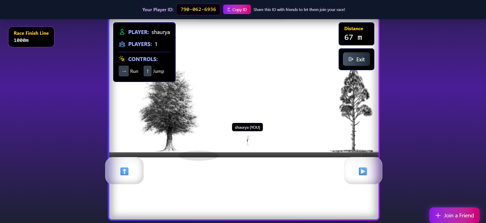

<h1 align="center">🕹️ Stickman Online Multiplayer Race</h1>

  <b>A fast-paced, real-time browser game where players race their stickman avatars live against each other!</b> 
  <i>Built with JavaScript, Node.js, Express, and Socket.io &mdash; features modern UI, seamless live gameplay, and full deployment.</i>

  
  
  
  

 

---

## 🚀 Live Demo

  <a href="https://stickman-onlinemultiplayer-race.vercel.app/">▶️ <b>Play the game now!</b></a>

---

<h2 align="center">🖼️ Game Screenshot</h2>

  
   
  
    <em>Preview: Stickman Online Multiplayer Race game interface</em>
  

---

## ✨ Features

<ul>
  <li>⚡ Real-time multiplayer stickman racing with live player synchronization using <b>Socket.io</b></li>
  <li>🟢 Seamless communication for an engaging and interactive user experience</li>
  <li>📱 Responsive UI - play on desktop or mobile devices</li>
  <li>🚀 Deployed frontend on <b>Vercel</b>, backend on <b>Render</b></li>
  <li>🔓 Open-source and ready for extension with new features!</li>
</ul>

---

## 🛠️ Tech Stack

<table>
  <tr>
    <td><b>Frontend</b></td>
    <td>JavaScript, HTML, CSS</td>
  </tr>
  <tr>
    <td><b>Backend</b></td>
    <td>Node.js, Express, Socket.io</td>
  </tr>
  <tr>
    <td><b>Deployment</b></td>
    <td>
      Frontend: <a href="https://vercel.com/">Vercel</a> 
      Backend: <a href="https://render.com/">Render</a>
    </td>
  </tr>
</table>

---

## 📝 Getting Started

<ol>
  <li><b>Clone the repository:</b>
    <pre>git clone https://github.com/shaurya-tiwari/stickman-onlinemultiplayer-race.git
cd stickman-onlinemultiplayer-race
</pre>
  </li>
  <li><b>Install dependencies:</b>
    <pre>npm install</pre>
  </li>
  <li><b>Run the server:</b>
    <pre>npm start</pre>
  </li>
  <li><b>Play locally:</b>
     Open your browser at <a href="http://localhost:3000">http://localhost:3000</a>
  </li>
</ol>

---

## 🌐 Deployment Info

- <b>Frontend:</b> Deployed on <a href="https://vercel.com/">Vercel</a>
- <b>Backend:</b> Deployed on <a href="https://render.com/">Render</a>

---

## 👤 Author

  

---

<i>Feel free to fork, enhance, or challenge your friends! Contributions welcome.</i>

